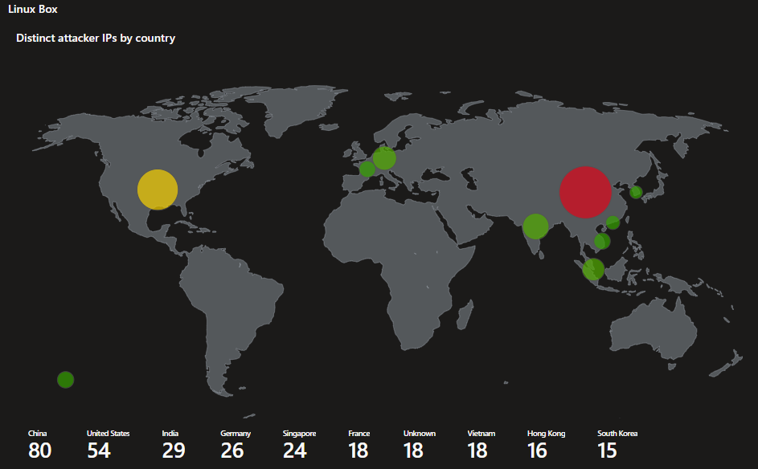
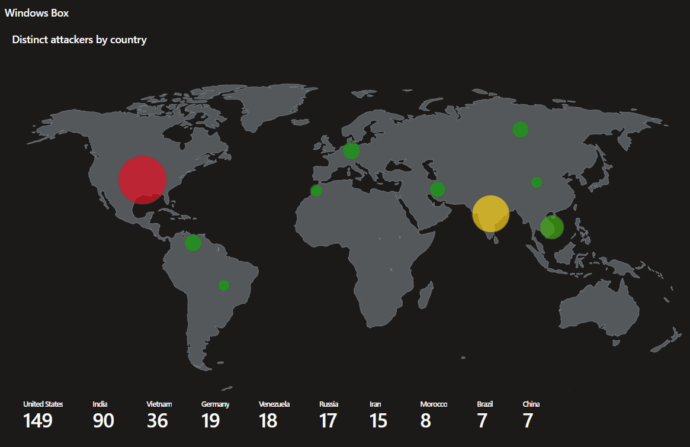
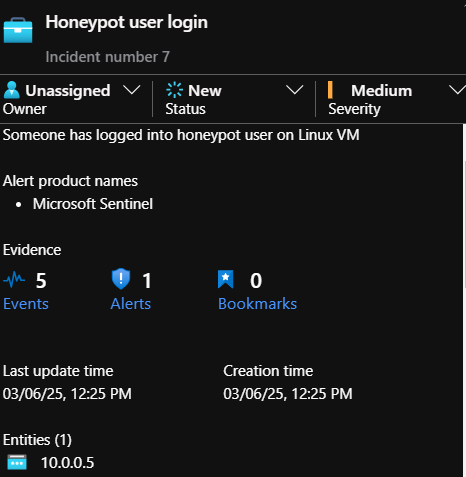
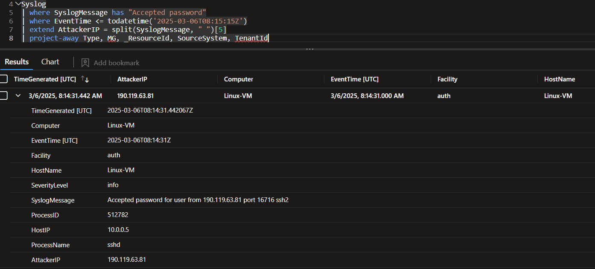

# Simple Honeynet in Azure

## Basic premise

As a cybersecurity nerd, I am always interested in getting hands-on experience. Theory and certifications are excellent, but nothing can really beat real-world usage. Thus, in order to develop further familiarity with SOC operations and non-simulated hacking attacks, I decided to set up a honeynet lab environment.

While one _could_ set up such a thing locally, I decided that exposing devices in my home network to the internet with the explicit purpose of being attacked was too risky. Furthermore, I had interest in gaining experience with Azure Sentinel as Azure environments are very prominent in the business world.

Below, we will see how I configured and ran this honeynet, what findings I came across, as well as limitations I ran into, lessons I learned, and what I would like to investigate to a greater extent if I get the opportunity to create another environment like this again.

## Setup

First off, I would like to give due credit to [Phillip Kitanski](https://github.com/kphillip1/) for significant inspiration and guidance on the setup for this lab. What I did here followed a modified version of his Azure honeynet tutorial, and the instructions he provided were invaluable for someone less experienced with the Azure environment figuring out how to set up this lab.

I did have to constrain my own setup from what Phillip used, however, as I can only operate on a budget of the Azure trial's $200 credit. As such, I simplified a significant amount of the environment.

Ultimately, what this lab environment comprised of is the following:

- A log analytics workspace
- An Azure Sentinel instance, configured to use that same log analytics workspace
- A Defender for Cloud instance
- Two virtual machines exposed to the internet, forwarding audit logs to the analytics workspace
	+ One VM running Ubuntu for visibility to SSH attacks
	+ One machine running Windows 10 for visibility to RDP attacks
	
Firewall rules would be set with an explicit any/any allow rule for external access to the VMs and host-based firewall on the Windows machine would be disabled.

Later, I would also configure two users (`minecraft` and `user`) on the Ubuntu machine based on usernames attackers were spraying with, configuring .bashrc and rsyslog to log commands run by all users. Accordingly, I set up Sentinel with the `Custom logs via AMA` data connector in order to ingest these logs for analysis. Unfortunately, as we will find, this did not end up logging anything relevant, despite finding evidence that an atacker did, in fact, run commands from that machine.

I configured a custom alert on Sentinel to alert me to a successful login to either of the honeypot users on the Ubuntu machine and note the attacking IP as an entity for threat intelligence. The KQL syntax of this alert was simple enough:

```kql
Syslog
| where SyslogMessage has "Accepted password for minecraft" or SyslogMessage has "Accepted password for admin"
| extend AttackIP = tostring(split(SyslogMessage, " ")[5])
```
I then tuned the alerts to ignore logins coming from my home IP where I was running tests.

## Findings

The first thing I chose to do after giving the lab a night to sit and collect traffic was to start digging into the IPs that were coming from attacking machines. One of the queries I performed looked through the audit logs for failed authentication attempts, listed out distinct IP addresses, and then gathered geolocation data for those IPs. What immediately jumped out as interesting to me was that between the two services (SSH and RDP), there was a significant difference in which countries had more IPs attacking. Finding this odd, I decided to let this sit for longer in order to gather data, thinking that perhaps a single day had simply led to skewed results.

By the time my trial had ended, I had significantly more data and the discrepancy in countries remained the same. Below are two graphs showing the countries that had IPs attacking each machine, heatmapped to show number of distinct IPs per country, limited to the top 10.




Of particular curiosity to me is that Chinese IPs are so heavily relevant to attacks on the Linux machine, but much less significant in attacking the Windows one. Similarly, Indian IPs are very prevalent in attacking the Windows machine, but less so for Linux. United States traffic was highly relevant for both.

This of course does not necessarily show what countries the attackers are _from_, but rather what the final hop they used to attack from was. This information is still interesting, however, as it may also indicate that attackers prefer to attack different types of machines from different hosting providers. While I would hesitate from making any causal conclusions from the data here (More honeynet machines being hosted in different zones could provide for less chance of bias in data gathered), it does indicate things that may be worth greater attention and investigation.

Furthermore, while there were no commands logged from users that were not executed by myself during testing of the logging functionality, I was able to find that an attacker _did_ run commands from a user on the Linux machine.

The last incident that arose before I ran out of trial credits indicated a login to the honeypot users coming from `10.0.0.5` - the internal IP address of the Linux VM in my Azure virtual network.



Drilling down further into this, we find from authorization logs that `10.0.0.5` attempted password sprays for all the users on that machine, and _only_ for the users on that machine - including the admin user that I had set up with a name not found on user spray lists. This is evidence that an attacker had not only logged in and run attacks from the machine, but that they had also performed reconnaissance on the users within that machine (I would expect via a read of `/etc/passwd`, but do not have the logs to make a definitive statement on that matter).

I then dug into the authentication logs for the Linux VM to see who logged into it from a remote IP address before the internal attacks began (`2025-03-06 08:15:15Z`). I found that a login had occurred on one of the honeypot users (`user`) at `2025-03-06 08:14:31Z`, less than a minute before the internal password spraying had begun. This attack had come from `190.119.63.81`.



This gives us a timeline to start with for initial access. Without command logs, I was unable to fingerprint the attacker from specifics of what they ran on the machine. However, I was able to investigate a few things.

Number one, I was able to resolve the IP as originating in Peru. I also checked the list of users that IP had attempted to use during their initial spraying attacks in order to profile what kind of actor they may be or what kind of target they may show interest in. Unfortunately, the userlist they seem to have used was very generic, populated entirely out of common services one may expect to find in production environments, and as such was not particularly helpful in fingerprinting.

A quick check at virustotal, however, did show that others had reported the same IP as being malicious, phishing-related, and malware-related. No attribution to any particular organizations was made, however. This, in addition to the generic userlist leads me to believe that this is likely just a criminal hacker not associated with a larger support network.

If I had more time with my Azure trial, I would have liked to do further digging into this attacker and monitor more of what they do. As it is, I would currently simply recommend their IP be added to a blocklist, and move on.

## Issues/Lessons learned

First and foremost from my lessons learned by this exercise is that the method I set up for logging commands was insufficient. Upon further research, I have found that any methodology that makes use of `history` in Linux is easily evaded by the addition of a single whitespace before a command. While I cannot be certain that this is what the Peruvian IP had done to evade my logging, it is by far the simplest way to hide and shows that my logging method requires further examination. After further research, in future deployments of linux machines where I need to log commands, I will instead opt to use `auditd` which is far more robust.

Secondly, I found that I need to be more specific with what services I run. While experience with my own home lab means that I am able to run whatever I want with impunity. However, this attitude on a cloud account lead me to running out of credits owing to services that I was not actively using - in this case the biggest spender was Microsoft Defender for Cloud. While I had plans to use this service, I set it up far in advance of actually making use of it, meaning that it ended up eating a lot of my credits just existing and by the time I wanted to start digging into it, the trial was nearly over. I will need to be more purposeful about when I start services in cloud environments - even when I know that I _will_ want to be using them down the line.

I did get some interesting information that I want to dig into further down the line from this experiment, however. Primarily, I am very curious about the discrepany in IPs attacking different services and why that may be. Some have posited that RDP traffic from China is limited because China's "great firewall" may play havoc with RDP traffic. I do not know for certain if it is true, but a nationwide security policy would make sense as an explanation for why there is such a stark difference in RDP and SSH attacks from China.

I would, however, want to set some things up differently before further examination of this question. While my results are intriguing, I do not think that a sample size of one machine for each service is adequate for drawing larger conclusions. With more time and funds down the line, I would rather like to see if I could make a number of different machines for each service, spread across different geographic regions, and then see if the results still show the same discrepancy that they did here.